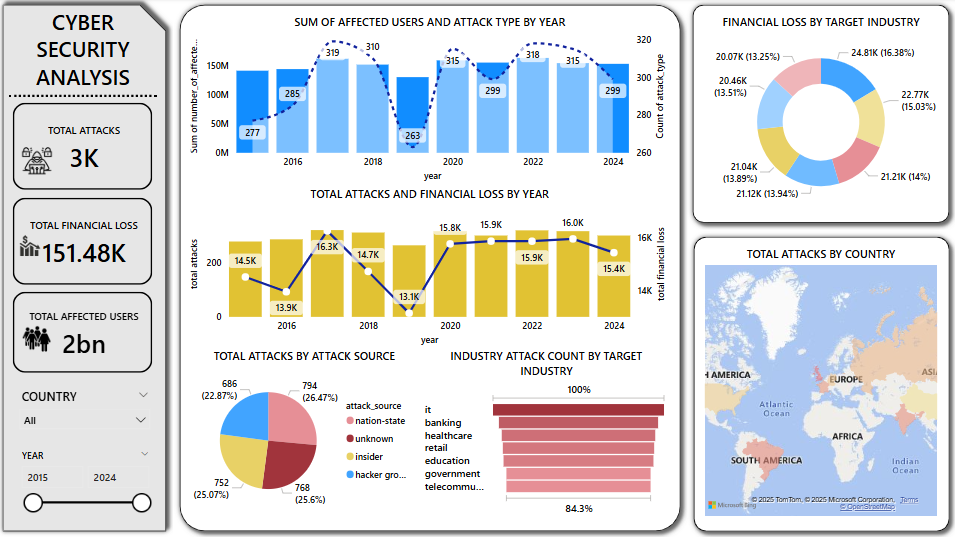

# 🛡️ Cybersecurity Threat Analysis Project

This project is a comprehensive analysis of global cybersecurity incidents using MySQL, Python (Jupyter Notebook), and Power BI. The dataset captures details about attacks by year, country, industry, and more, aiming to uncover trends and insights from historical cyberattacks.

---

## 📌 Objectives

- Analyze the frequency and impact of cyberattacks
- Identify the most vulnerable countries and industries
- Explore common attack types and sources
- Assess financial losses over time
- Measure effectiveness of defense mechanisms
- Visualize findings using Power BI

---

## 🧰 Tools & Technologies

- **MySQL** – For creating database and running SQL queries
- **Jupyter Notebook (Python)** – For connecting to MySQL and exploring data
- **Power BI** – For building interactive dashboards
- **GitHub** – For version control and project sharing

---

## 🗂️ Project Structure

```
cybersecurity-data-analysis/
├── cybersecuritydata.ipynb         # Notebook: data access + insights
├── cybersecuritymysql.sql          # SQL script with all queries used
├── cybersecuritypowerbi.PNG        # Screenshot of final dashboard
├── README.md                       # Project overview
```

---

## 🗃️ Dataset Fields (in `cyberthreats` table)

- `country`: Country affected
- `year`: Year of incident
- `attack_type`: Type of attack (e.g., phishing, malware)
- `target_industry`: Industry affected
- `financial_loss_in_million_dollars`: Estimated financial loss
- `number_of_affected_users`: People/users impacted
- `attack_source`: Source of attack (internal/external)
- `security_vulnerability_type`: Weakness exploited
- `defence_mechanism_used`: Preventive method used
- `incident_resolution_time_in_hours`: Time to resolve

---

## 📈 Key Insights & SQL Queries

### ✅ Total Incidents
```sql
SELECT COUNT(*) FROM cyberthreats;
```

### ✅ Most Targeted Countries
```sql
SELECT country, COUNT(*) AS total_incidents
FROM cyberthreats
GROUP BY country
ORDER BY total_incidents DESC
LIMIT 10;
```

### ✅ Financial Loss by Year
```sql
SELECT year, SUM(financial_loss_in_million_dollar) AS yearly_financial_loss
FROM cyberthreats
GROUP BY year
ORDER BY year;
```

### ✅ Average Resolution Time by Industry
```sql
SELECT target_industry,
       AVG(incident_resolution_time_in_hours) AS avg_resolution_time
FROM cyberthreats
GROUP BY target_industry
ORDER BY avg_resolution_time DESC;
```

> 🗂 Full SQL query set available in `cybersecuritymysql.sql`

---

## 📊 Power BI Dashboard Overview

The dashboard includes:

- Trend of attacks over the years  
- Top 5 attack types and vulnerable industries  
- Global view of most affected countries  
- Financial loss visualization  
- Resolution time comparison  

📷 **Sample Screenshot**:



---

## 📁 How to Run the Project

1. Clone this repo:
   ```bash
   git clone https://github.com/yourusername/cybersecurity-data-analysis.git
   ```
2. Open MySQL Workbench and run `cybersecuritymysql.sql`
3. Open the notebook: `cybersecuritydata.ipynb`
4. Use Power BI to connect to the database and create visuals

---

## 🙋‍♂️ Author

**Sri**  
🔗 [www.linkedin.com/in/asrilakshmi0509](#)  
📫 asrilakshmi8897@gmail.com

---

## 📄 License

This project is open-source and available under the [MIT License](LICENSE).
